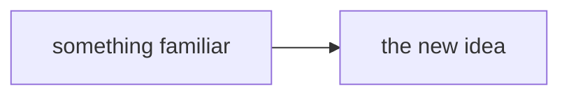

# Pedagogy — how to write a chapter people actually understand

The techniques below are the ones that survived a 26-chapter, 45,000-word build. They are ordinary
instructional design, applied to systems documentation.

## The chapter template

````markdown
:::callout 🧭 blue_background
**Where you are:** chapter N of M. **Assumes:** [chapter K]({{slug}}). **Time:** X minutes.
**After this page you can explain:** the two or three things the reader will be able to say out loud.
:::

One paragraph starting from something the reader already understands. No preamble, no "in this
chapter we will".

## First idea

Analogy, then the diagram, then the mechanism.



:::callout ⚠️ yellow_background
**Misconception:** the wrong belief people actually hold, stated in their words, then corrected.
:::

## Worked example

Concrete values, followed step by step, ending at the answer.

---

:::toggle ✅ Check yourself — four questions
**Q. The question this page exists to answer.**
The answer, plainly.
:::

## Terms introduced here

**term**, **term**, **term** — see the [glossary]({{glossary-slug}}).

## Where this lives in the real system

- The repo, file, PR, or doc a curious reader should open next
````

## The seven patterns that carry the most weight

**1. Objectives as sentences the reader can say.**
"After this page you can explain why the browser is not the owner of the document" beats "this
chapter covers ownership." It gives the reader a self-test and it forces you to have a point.

**2. Concrete before abstract, always.**
Two people editing a shopping list, then CRDTs. A counter that two disconnected people increment,
then convergence. The abstraction is the _second_ thing on the page, never the first.

**3. Build the problem before the solution.**
Give the hard mechanism its own chapter, and put a problem chapter immediately before it that walks
the naive approaches and shows each one failing. A reader who has felt the problem retains the
solution; a reader handed the solution first memorises it.

**4. Dual coding — one diagram per idea, adjacent to its prose.**
Text and picture together beat either alone. Keep diagrams small and _mechanistic_: show what moves
where. Sequence diagrams for "what happens when", flowcharts for "what talks to what", state
diagrams for lifecycles. A diagram that is merely decorative costs attention and returns nothing.

**5. Name misconceptions explicitly.**
Do not just state the truth — state the wrong belief first, in the words people use, then correct
it. Someone holding a misconception will read a correct statement and not notice it contradicts
them. `**Misconception:** "V0 is the CRDT version with bugs." It isn't — V0 contains no CRDT at all.`

**6. Retrieval practice, collapsed.**
Three to five questions at the end of each chapter with answers hidden in a toggle. Questions should
target the thing the chapter exists to teach, not trivia. Collapsed so they do not interrupt reading
flow but are one click away.

**7. Say what is not built.**
A per-capability status table (`✅ built / 🟡 designed, protocol-ready / ❌ not planned`) is more
informative than any amount of prose. It is also what makes the primer trustworthy: a document that
admits its gaps gets believed about everything else.

## Vocabulary discipline

- Define a term the first time it appears, in the sentence that uses it. Never forward-reference.
- Prefer the plain word, then introduce the jargon as its name: _"a marker meaning 'this was
  deleted' — called a **tombstone**"_.
- Keep a term's definition identical across chapters. If two chapters need different nuance, that is
  two terms.
- Expand every acronym on first use per page — readers arrive mid-series from the glossary.
- Where an official name is confusing or legacy, say so. `layoutFollowerBridge` deliberately does not
  touch the layout store; a reader who notices the contradiction and finds no acknowledgement of it
  starts distrusting the document.

## Voice

Short sentences. Aim for a mean around 15 words. Second person. Active. Contractions are fine.

State conclusions rather than staging them: not "it is worth noting that X", just "X". Cut
"basically", "simply", "just" — they tell a confused reader the thing they do not understand is
easy, which is the opposite of helpful.

One idea per paragraph. If a paragraph has two, it has two paragraphs.

## What to cut

- Anything the reader cannot act on and will not be asked about
- Historical narrative that does not change today's understanding — link to it instead
- Exhaustive enumerations; give the shape and link the reference
- Hedging that protects the author rather than informing the reader. "May potentially in some cases"
  means you have not checked. Go check, then say the thing.

## The glossary specification

One alphabetical table, three columns:

| Term          | Plain English                                                                                                                     | Where it shows up                                         |
| ------------- | --------------------------------------------------------------------------------------------------------------------------------- | --------------------------------------------------------- |
| **tombstone** | A "this was deleted" marker kept instead of removing an entry, so a copy that never heard about the deletion cannot resurrect it. | [ch. 7]({{07-crdt}}) · `applyOps()` in the shared library |

The third column is the reason this page exists: it turns a definition list into a map. Link to both
the chapter that teaches the term and the real doc/repo/file where it appears.

Two additions that pay for themselves:

- **A "start with these twelve terms" block at the top.** Most conversations use a small core.
  Give the reader the core before the alphabet.
- **A "frequently confused" table at the bottom.** `X ⟷ Y — what the actual difference is — the
chapter that settles it`. This is consistently the most-used section, because the failure mode in
  real meetings is not "I don't know that word", it is "I thought those were the same thing".

## An FAQ is not filler

Collect the questions people actually ask and the mistakes they actually make. Two sections:

- **Misconceptions**, each as a collapsible `❌ "the wrong claim"` with the correction inside.
- **A "sentences that should make you ask a follow-up" table** — ambiguous phrases heard in
  standups, paired with the disambiguating question. `"the agent API" → control plane or data
plane?` This teaches a reader to navigate conversations, which is the actual goal.
